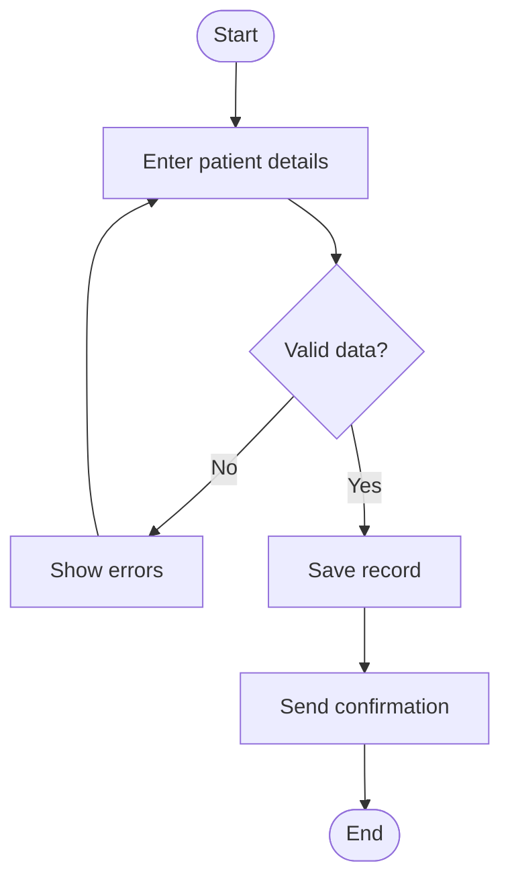
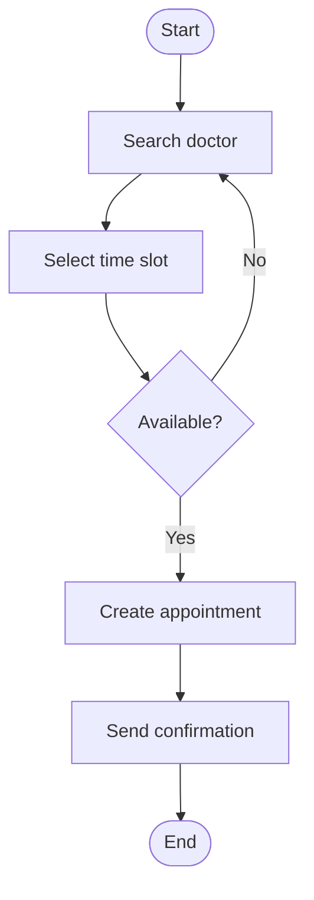
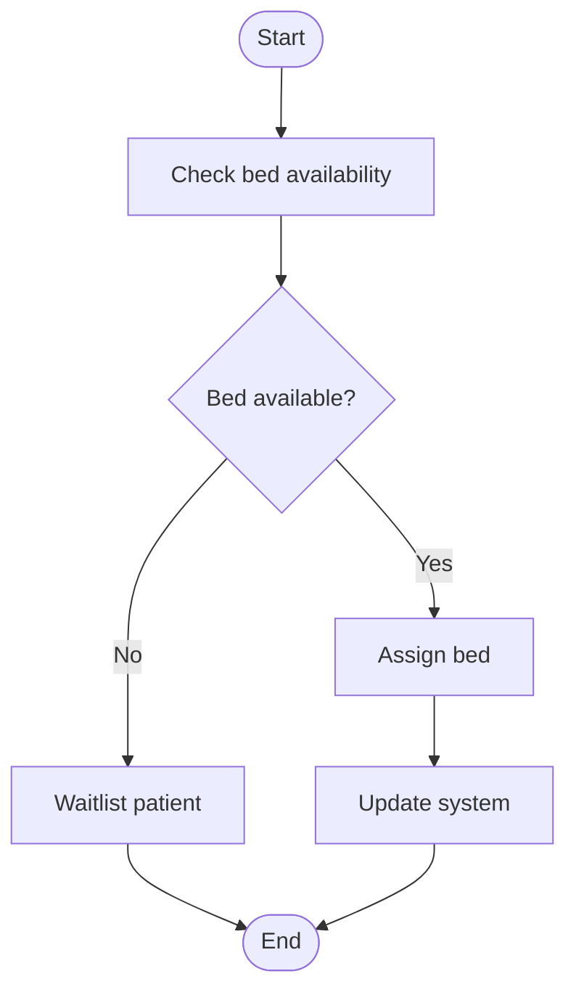
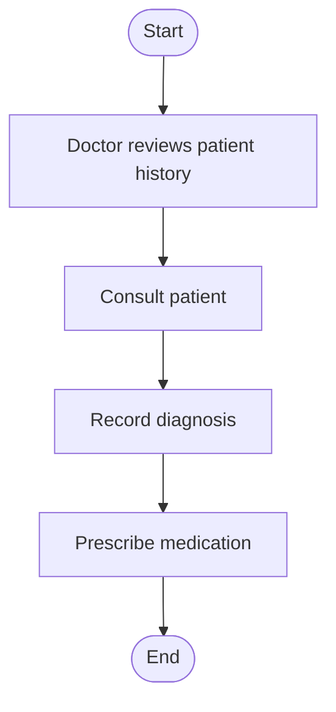
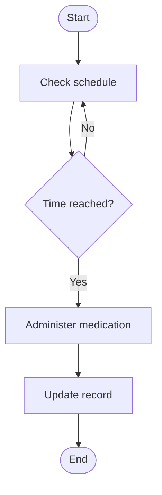
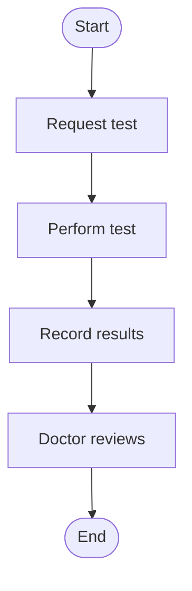
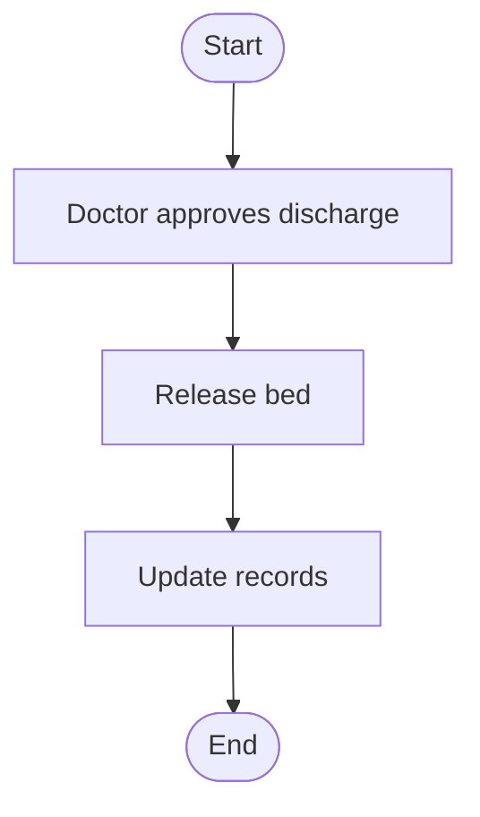
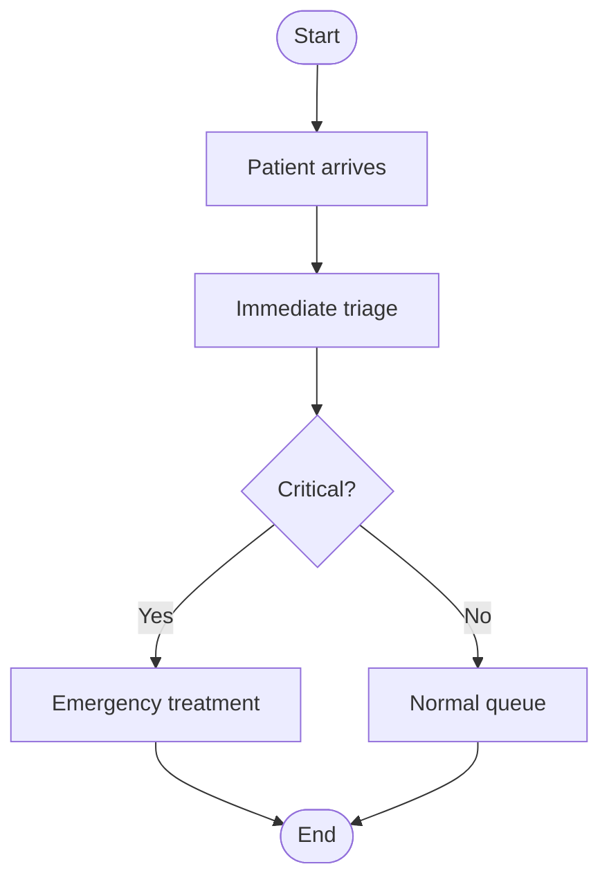

# Rural Hospital Digital System — Workflow Overview

This document describes 8 core workflows used in the rural hospital digital system, modelled as UML activity diagrams with start/end nodes, decisions, parallel flows, and swimlanes (Patient, Staff, System).

---

## Workflow 1: Patient Registration

Ensures valid patient onboarding by validating data before saving.

**Swimlanes:** Patient enters details → System validates → System saves and sends confirmation.

---

## Workflow 2: Appointment Booking

Searches for an available doctor and time slot, then confirms the booking.

**Swimlanes:** Patient searches and selects → System checks availability → System creates appointment and confirms.

---

## Workflow 3: Patient Admission

Checks bed availability and either assigns a bed or places the patient on a waitlist.

**Swimlanes:** Staff checks availability → System assigns or waitlists → System updates records.

---

## Workflow 4: Consultation

Doctor reviews patient history, consults the patient, records the diagnosis, and prescribes medication.

**Swimlanes:** Staff reviews history → Staff consults patient → Staff records diagnosis and prescription.

---

## Workflow 5: Medication Administration

Polls the schedule until it is time to administer medication, then updates the patient record.

**Swimlanes:** System monitors schedule → Staff administers medication → System updates record.

---

## Workflow 6: Lab Test Processing

Lab test is requested, performed, and results are recorded for doctor review.

**Swimlanes:** Staff requests test → Lab performs and records → Staff (doctor) reviews results.

---

## Workflow 7: Discharge Patient

Doctor approves discharge, the bed is released, and all records are updated.

**Swimlanes:** Staff approves → System releases bed → System updates records.

---

## Workflow 8: Emergency Handling

Immediate triage determines whether the patient is critical, routing to emergency treatment or the normal queue.

**Swimlanes:** Patient arrives → Staff triages → System routes to emergency or normal queue.

---

## Summary Table

| # | Workflow | Key Decision | Outcome |
|---|----------|-------------|---------|
| 1 | Patient Registration | Valid data? | Save record or show errors |
| 2 | Appointment Booking | Available? | Create booking or retry |
| 3 | Patient Admission | Bed available? | Assign bed or waitlist |
| 4 | Consultation | — | Diagnosis and prescription recorded |
| 5 | Medication Administration | Time reached? | Administer and update record |
| 6 | Lab Test Processing | — | Results recorded and reviewed |
| 7 | Discharge Patient | — | Bed released and records updated |
| 8 | Emergency Handling | Critical? | Emergency treatment or normal queue |
