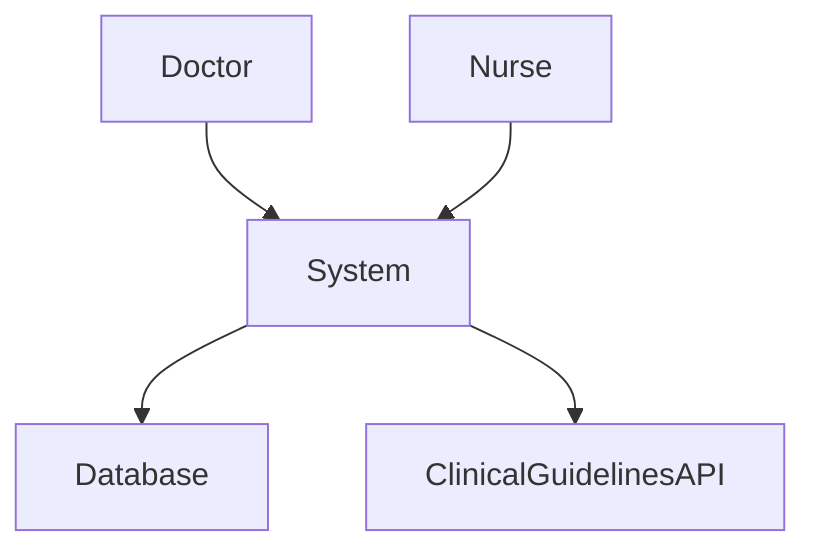
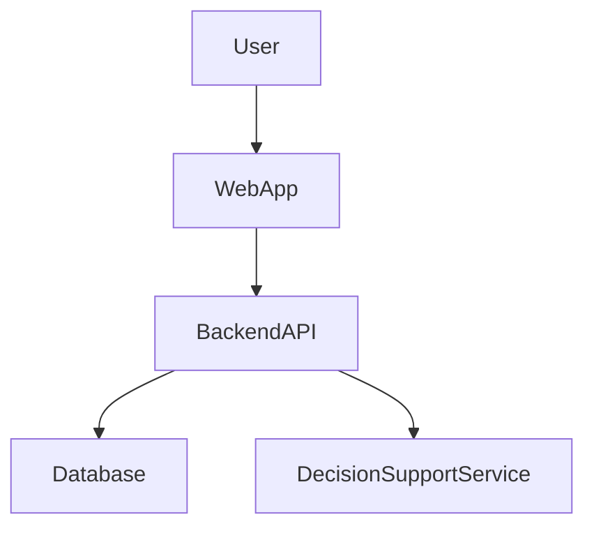
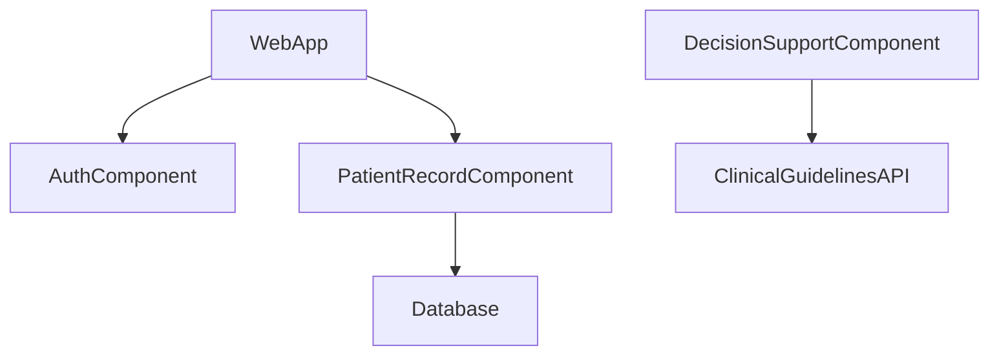

# 4. ARCHITECTURE.md

- Context Diagram
- Container Diagram
- Component Diagram

---

# 5. C4 Context Diagram

## System Architecture

### Explanation

- **Doctor / Nurse** → Users of the system  
- **System** → Digital Decision Support System  
- **Database** → Stores patient records  
- **Clinical Guidelines API** → External medical data

---

# 6. Container Diagram

### Containers

- **Web Application** – Interface used by doctors and nurses  
- **Backend API** – Handles system logic and requests  
- **Decision Support Service** – Provides clinical recommendations  
- **Database** – Stores patient and medical data  

---

# 7. Component Diagram

### Components

- **Authentication Component** – Manages login and user security  
- **Patient Record Component** – Handles patient information  
- **Decision Support Component** – Processes clinical guidelines  

---

# 8. End-to-End Components 

**User → Interface → Backend → Services → Database → External Systems**
