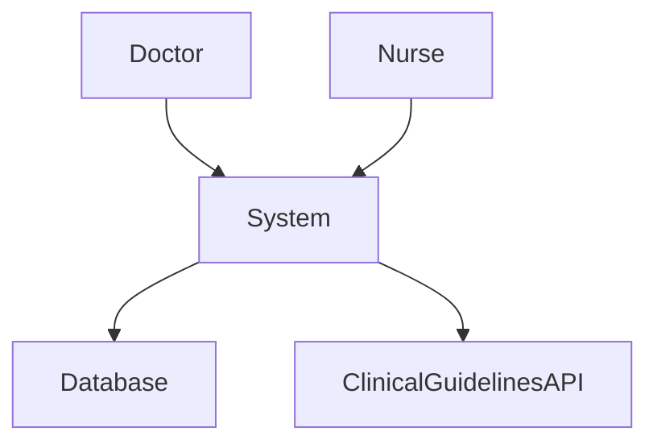
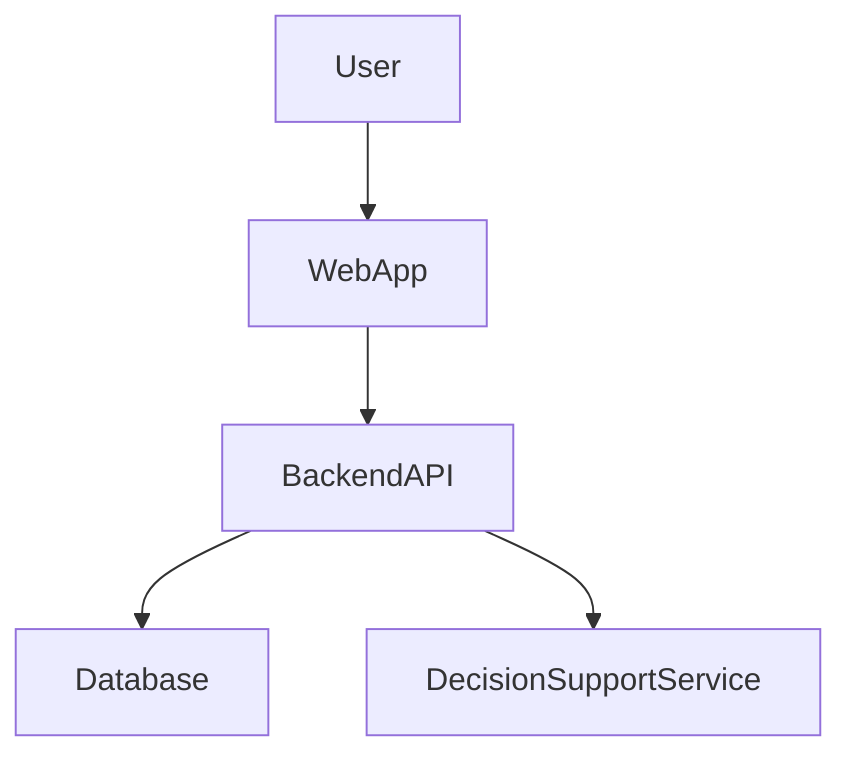
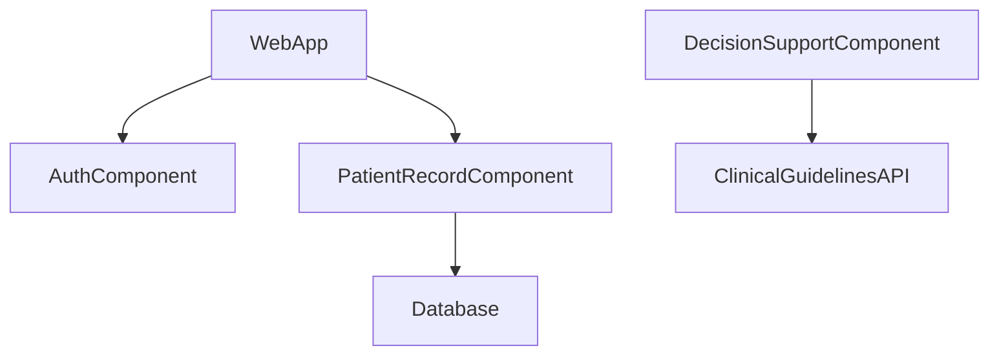

# rural-hospital-digital-system
This project proposes a digital system designed to support clinical decision-making in rural hospitals.  The system will allow healthcare workers to access patient records, receive clinical decision support,  and manage patient information through a centralized platform.
The goal of the system is to improve patient care, reduce medical errors, and support healthcare 
professionals in making informed clinical decisions.

## Project Documentation

- [System Specification](SPECIFICATION.md)
- [System Architecture](ARCHITECTURE.md)

# System Specification

## 1. Project Title
Rural Hospital Digital Decision Support System

## 2. Domain
Healthcare – Rural Hospitals

This system operates within the healthcare domain, specifically focusing on rural hospitals where 
healthcare professionals often lack access to advanced digital systems. The system will support 
doctors and nurses by providing access to patient data and clinical decision tools.

## 3. Problem Statement
Many rural hospitals still rely on paper-based systems or incomplete digital systems. 
This makes it difficult for healthcare professionals to access patient records quickly and make 
accurate clinical decisions.

This project proposes a digital decision support system that improves access to patient information 
and assists clinicians with evidence-based decision-making.

## 4. System Objectives
The system will:

- Store patient medical records
- Support clinical decision-making
- Provide secure access for healthcare professionals
- Improve patient care in rural hospitals

## 5. Key Features

- Patient record management
- Clinical decision support
- Secure login for doctors and nurses
- Data storage in a centralized database

## 6. Individual Scope

This project is feasible for an individual developer because:

- The system will be implemented as a prototype
- Only core features will be developed
- External integrations will be simulated

# 4. ARCHITECTURE.md (C4 Model)

- Context Diagram
- Container Diagram
- Component Diagram

---

# 5. C4 Context Diagram

## System Architecture

### Explanation

- **Doctor / Nurse** → Users of the system  
- **System** → Digital Decision Support System  
- **Database** → Stores patient records  
- **Clinical Guidelines API** → External medical data

---

# 6. Container Diagram

### Containers

- **Web Application** – Interface used by doctors and nurses  
- **Backend API** – Handles system logic and requests  
- **Decision Support Service** – Provides clinical recommendations  
- **Database** – Stores patient and medical data  

---

# 7. Component Diagram

### Components

- **Authentication Component** – Manages login and user security  
- **Patient Record Component** – Handles patient information  
- **Decision Support Component** – Processes clinical guidelines  

---

# 8. End-to-End Components 

**User → Interface → Backend → Services → Database → External Systems**

# Stakeholder Analysis
## Rural Hospital Digital Decision Support System

| Stakeholder | Role | Key Concerns | Pain Points | Success Metrics |
|--------------|------|--------------|-------------|----------------|
| Doctors | Use the system to review patient records and receive decision support recommendations | Accurate patient data and reliable clinical recommendations | Delays in accessing patient records and lack of decision support tools | Reduce diagnosis time by 30% |
| Nurses | Record patient vitals, update patient records, and assist doctors | Easy-to-use interface and quick data entry | Paper-based recording and duplicated work | Reduce patient record entry time by 25% |
| Hospital Administrators | Monitor hospital performance and patient flow | Accurate reports and operational insights | Lack of centralized patient information | Generate reports in under 5 seconds |
| IT Staff | Maintain and manage the system infrastructure | System reliability, security, and easy maintenance | Frequent technical failures and poor integration | Achieve 99% system uptime |
| Patients | Receive healthcare services supported by the system | Accurate records and reduced waiting times | Lost or incomplete patient records | Reduce waiting time by 20% |
| Government Health Department | Oversees healthcare quality and compliance | Standardized data reporting and improved healthcare outcomes | Lack of reliable healthcare data from rural hospitals | Improve reporting accuracy by 40% |
| Medical Researchers | Analyze anonymized health data for research | Access to structured health data | Limited digital health data in rural settings | Increase availability of research data |

# System Requirements Document (SRD)

## Project Title
Rural Hospital Digital Decision Support System

## 1. Introduction
The Rural Hospital Digital Decision Support System is designed to assist healthcare professionals in rural hospitals by providing access to patient records and clinical decision support tools. The system will digitize patient management processes and help healthcare professionals make informed decisions.

---

# 2. Functional Requirements

### FR1: User Authentication
The system shall allow healthcare professionals to log in using secure credentials.

Acceptance Criteria:
- Users must enter a valid username and password.
- Unauthorized users must be denied access.

---

### FR2: Patient Record Management
The system shall allow healthcare professionals to create, update, and view patient records.

Acceptance Criteria:
- Patient records must include name, age, medical history, and diagnosis.

---

### FR3: Patient Search
The system shall allow users to search for patient records by name or patient ID.

Acceptance Criteria:
- Search results must appear within 2 seconds.

---

### FR4: Clinical Decision Support
The system shall provide evidence-based treatment recommendations based on patient symptoms.

Acceptance Criteria:
- Recommendations must be generated based on stored medical guidelines.

---

### FR5: Vital Signs Recording
The system shall allow nurses to record patient vital signs including blood pressure, temperature, and heart rate.

---

### FR6: Medical History Access
The system shall allow doctors to view a patient's previous diagnoses and treatments.

---

### FR7: Reporting Dashboard
The system shall generate hospital performance reports for administrators.

Acceptance Criteria:
- Reports must include patient statistics and treatment outcomes.

---

### FR8: Alerts and Notifications
The system shall notify healthcare professionals of critical patient conditions.

---

### FR9: Data Export
The system shall allow authorized users to export anonymized patient data for research purposes.

---

### FR10: User Role Management
The system shall support different user roles such as Doctor, Nurse, Administrator, and IT Staff.

---

# 3. Non-Functional Requirements

## Usability
NFR1: The system interface shall be simple and easy to use for healthcare professionals with minimal technical training.

NFR2: The system shall follow accessibility guidelines to ensure usability for all users.

---

## Deployability
NFR3: The system shall be deployable on both Windows and Linux servers.

NFR4: The system shall support cloud-based deployment.

---

## Maintainability
NFR5: The system shall include comprehensive documentation for developers and IT staff.

---

## Scalability
NFR6: The system shall support at least 1,000 concurrent users without performance degradation.

---

## Security
NFR7: All patient data shall be encrypted using AES-256 encryption.

NFR8: User authentication shall include role-based access control.

---

## Performance
NFR9: Patient record retrieval shall occur within 2 seconds.

NFR10: The system shall maintain 99% uptime.

# Reflection: Challenges in Balancing Stakeholder Needs

During the requirements elicitation process, one of the major challenges was balancing the needs of different stakeholders. Doctors and nurses required a system that is quick and easy to use during patient care. However, IT staff prioritized system security, reliability, and maintainability.

Another challenge was addressing the needs of hospital administrators who require detailed reporting and analytics, while ensuring that the system remains simple enough for healthcare professionals who may not have advanced technical skills.

Scalability was also an important consideration because the system should be able to expand to multiple rural hospitals in the future. However, implementing scalable infrastructure can increase system complexity.

To address these challenges, the system requirements were designed to balance usability, security, and performance while ensuring that the system remains practical for rural hospital environments with limited technical resources.
