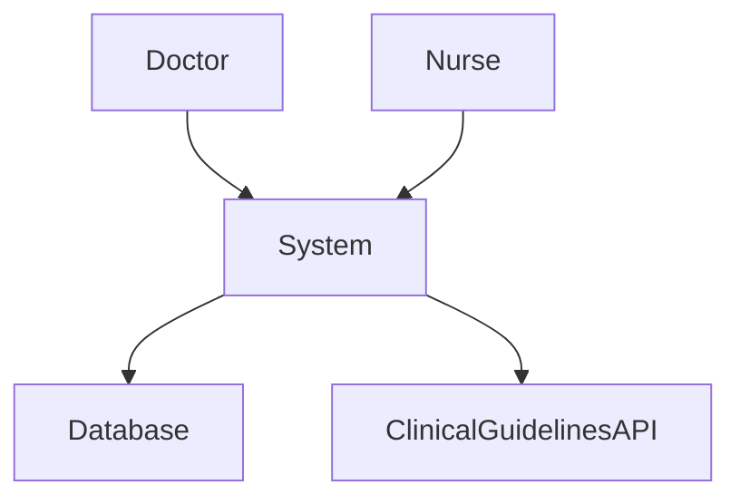
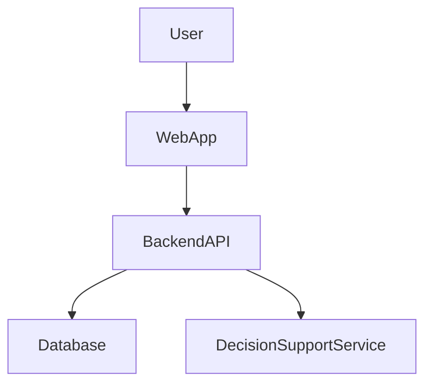
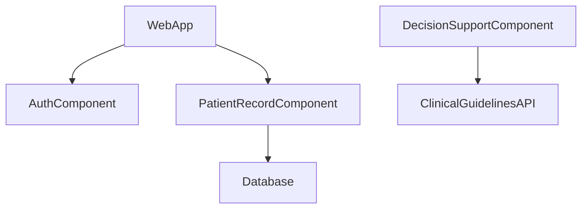
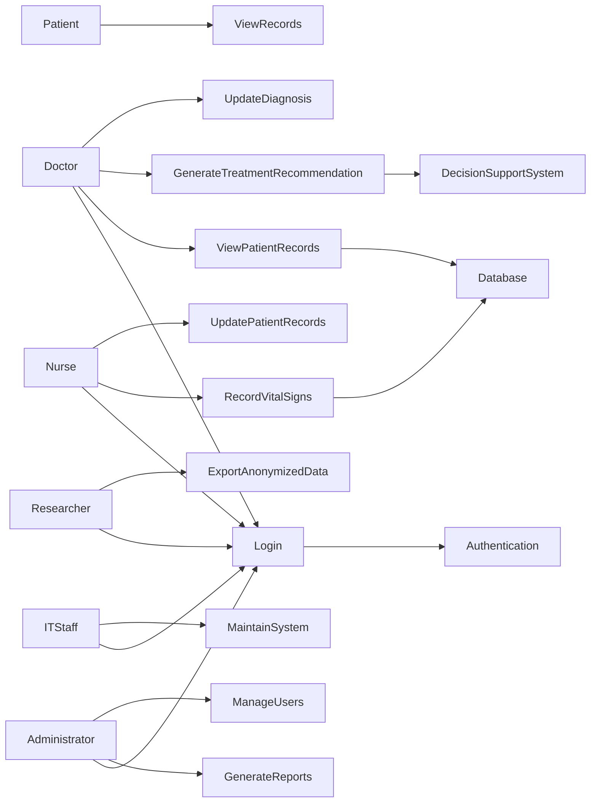

# rural-hospital-digital-system
This project proposes a digital system designed to support clinical decision-making in rural hospitals.  The system will allow healthcare workers to access patient records, receive clinical decision support,  and manage patient information through a centralized platform.
The goal of the system is to improve patient care, reduce medical errors, and support healthcare 
professionals in making informed clinical decisions.

## Project Documentation

- [System Specification](SPECIFICATION.md)
- [System Architecture](ARCHITECTURE.md)

# System Specification

## 1. Project Title
Rural Hospital Digital Decision Support System

## 2. Domain
Healthcare – Rural Hospitals

This system operates within the healthcare domain, specifically focusing on rural hospitals where 
healthcare professionals often lack access to advanced digital systems. The system will support 
doctors and nurses by providing access to patient data and clinical decision tools.

## 3. Problem Statement
Many rural hospitals still rely on paper-based systems or incomplete digital systems. 
This makes it difficult for healthcare professionals to access patient records quickly and make 
accurate clinical decisions.

This project proposes a digital decision support system that improves access to patient information 
and assists clinicians with evidence-based decision-making.

## 4. System Objectives
The system will:

- Store patient medical records
- Support clinical decision-making
- Provide secure access for healthcare professionals
- Improve patient care in rural hospitals

## 5. Key Features

- Patient record management
- Clinical decision support
- Secure login for doctors and nurses
- Data storage in a centralized database

## 6. Individual Scope

This project is feasible for an individual developer because:

- The system will be implemented as a prototype
- Only core features will be developed
- External integrations will be simulated

# 4. ARCHITECTURE.md (C4 Model)

- Context Diagram
- Container Diagram
- Component Diagram

---

# 5. C4 Context Diagram

## System Architecture

### Explanation

- **Doctor / Nurse** → Users of the system  
- **System** → Digital Decision Support System  
- **Database** → Stores patient records  
- **Clinical Guidelines API** → External medical data

---

# 6. Container Diagram

### Containers

- **Web Application** – Interface used by doctors and nurses  
- **Backend API** – Handles system logic and requests  
- **Decision Support Service** – Provides clinical recommendations  
- **Database** – Stores patient and medical data  

---

# 7. Component Diagram

### Components

- **Authentication Component** – Manages login and user security  
- **Patient Record Component** – Handles patient information  
- **Decision Support Component** – Processes clinical guidelines  

---

# 8. End-to-End Components 

**User → Interface → Backend → Services → Database → External Systems**

# Stakeholder Analysis
## Rural Hospital Digital Decision Support System

| Stakeholder | Role | Key Concerns | Pain Points | Success Metrics |
|--------------|------|--------------|-------------|----------------|
| Doctors | Use the system to review patient records and receive decision support recommendations | Accurate patient data and reliable clinical recommendations | Delays in accessing patient records and lack of decision support tools | Reduce diagnosis time by 30% |
| Nurses | Record patient vitals, update patient records, and assist doctors | Easy-to-use interface and quick data entry | Paper-based recording and duplicated work | Reduce patient record entry time by 25% |
| Hospital Administrators | Monitor hospital performance and patient flow | Accurate reports and operational insights | Lack of centralized patient information | Generate reports in under 5 seconds |
| IT Staff | Maintain and manage the system infrastructure | System reliability, security, and easy maintenance | Frequent technical failures and poor integration | Achieve 99% system uptime |
| Patients | Receive healthcare services supported by the system | Accurate records and reduced waiting times | Lost or incomplete patient records | Reduce waiting time by 20% |
| Government Health Department | Oversees healthcare quality and compliance | Standardized data reporting and improved healthcare outcomes | Lack of reliable healthcare data from rural hospitals | Improve reporting accuracy by 40% |
| Medical Researchers | Analyze anonymized health data for research | Access to structured health data | Limited digital health data in rural settings | Increase availability of research data |

# System Requirements Document (SRD)

## Project Title
Rural Hospital Digital Decision Support System

## 1. Introduction
The Rural Hospital Digital Decision Support System is designed to assist healthcare professionals in rural hospitals by providing access to patient records and clinical decision support tools. The system will digitize patient management processes and help healthcare professionals make informed decisions.

---

# 2. Functional Requirements

### FR1: User Authentication
The system shall allow healthcare professionals to log in using secure credentials.

Acceptance Criteria:
- Users must enter a valid username and password.
- Unauthorized users must be denied access.

---

### FR2: Patient Record Management
The system shall allow healthcare professionals to create, update, and view patient records.

Acceptance Criteria:
- Patient records must include name, age, medical history, and diagnosis.

---

### FR3: Patient Search
The system shall allow users to search for patient records by name or patient ID.

Acceptance Criteria:
- Search results must appear within 2 seconds.

---

### FR4: Clinical Decision Support
The system shall provide evidence-based treatment recommendations based on patient symptoms.

Acceptance Criteria:
- Recommendations must be generated based on stored medical guidelines.

---

### FR5: Vital Signs Recording
The system shall allow nurses to record patient vital signs including blood pressure, temperature, and heart rate.

---

### FR6: Medical History Access
The system shall allow doctors to view a patient's previous diagnoses and treatments.

---

### FR7: Reporting Dashboard
The system shall generate hospital performance reports for administrators.

Acceptance Criteria:
- Reports must include patient statistics and treatment outcomes.

---

### FR8: Alerts and Notifications
The system shall notify healthcare professionals of critical patient conditions.

---

### FR9: Data Export
The system shall allow authorized users to export anonymized patient data for research purposes.

---

### FR10: User Role Management
The system shall support different user roles such as Doctor, Nurse, Administrator, and IT Staff.

---

# 3. Non-Functional Requirements

## Usability
NFR1: The system interface shall be simple and easy to use for healthcare professionals with minimal technical training.

NFR2: The system shall follow accessibility guidelines to ensure usability for all users.

---

## Deployability
NFR3: The system shall be deployable on both Windows and Linux servers.

NFR4: The system shall support cloud-based deployment.

---

## Maintainability
NFR5: The system shall include comprehensive documentation for developers and IT staff.

---

## Scalability
NFR6: The system shall support at least 1,000 concurrent users without performance degradation.

---

## Security
NFR7: All patient data shall be encrypted using AES-256 encryption.

NFR8: User authentication shall include role-based access control.

---

## Performance
NFR9: Patient record retrieval shall occur within 2 seconds.

NFR10: The system shall maintain 99% uptime.

# Use Case Diagram
## Rural Hospital Digital Decision Support System

## Explanation (required for marks)

The main actors in the system are Doctors, Nurses, Administrators, IT Staff, Patients, and Researchers. 
Each actor interacts with the system based on their role in the hospital.

Doctors use the system to view patient records, update diagnoses, and generate treatment recommendations. 
Nurses record patient vital signs and update patient records. Administrators generate reports and manage 
system users. IT staff maintain the system, while researchers export anonymized data for research purposes.

The Login use case is shared by most actors, which shows reuse of functionality. The Generate Treatment 
Recommendation use case supports doctors by helping them make clinical decisions, which addresses the 
stakeholder concern of improving decision-making in rural hospitals.

# Use Case Specifications

## UC1: User Login
Actor: Doctor, Nurse, Administrator, IT Staff, Researcher  
Description: Allows authorized users to access the system securely.

Preconditions:
- User must be registered in the system.

Postconditions:
- User is successfully logged in.

Basic Flow:
1. User enters username and password.
2. System verifies credentials.
3. System grants access.

Alternative Flow:
- If credentials are incorrect, the system displays an error message.

---

## UC2: View Patient Records
Actor: Doctor

Preconditions:
- Doctor must be logged in.

Postconditions:
- Patient records are displayed.

Basic Flow:
1. Doctor searches for patient.
2. System retrieves patient information.
3. System displays patient records.

Alternative Flow:
- If patient does not exist, the system displays "Patient not found".

---

## UC3: Record Vital Signs
Actor: Nurse

Preconditions:
- Nurse must be logged in.

Postconditions:
- Patient vital signs are saved.

Basic Flow:
1. Nurse selects a patient.
2. Nurse enters vital signs.
3. System saves the data.

Alternative Flow:
- If required fields are missing, the system shows an error.

---

## UC4: Generate Treatment Recommendation
Actor: Doctor

Preconditions:
- Patient record must exist.

Postconditions:
- System generates a treatment suggestion.

Basic Flow:
1. Doctor selects patient symptoms.
2. System processes the information.
3. System displays treatment recommendations.

# Test Cases

| Test Case ID | Requirement ID | Description | Steps | Expected Result | Actual Result | Status |
|------------|---------------|------------|------|---------------|--------------|-------|
| TC001 | FR1 | User login with valid credentials | Enter username and password | User logged in successfully |  |  |
| TC002 | FR1 | User login with invalid password | Enter wrong password | Error message displayed |  |  |
| TC003 | FR2 | View patient records | Search patient ID | Patient records displayed |  |  |
| TC004 | FR3 | Record vital signs | Enter patient vitals | Data saved successfully |  |  |
| TC005 | FR4 | Generate treatment recommendation | Select symptoms | System generates recommendation |  |  |
| TC006 | FR5 | Generate reports | Click generate report | Report displayed |  |  |
| TC007 | FR6 | Export anonymized data | Click export | File downloaded |  |  |
| TC008 | FR7 | Manage users | Add new user | User added successfully |  |  |

## Non-Functional Test Scenarios

Performance Test:
Simulate 1,000 users accessing the system at the same time.
Expected Result: System response time must be less than 2 seconds.

Security Test:
Attempt login using incorrect credentials multiple times.
Expected Result: System must block the user after 5 failed attempts.

# Reflection: Challenges in Creating Use Cases and Test Cases

One of the main challenges in this assignment was translating system requirements into use cases. 
While functional requirements explain what the system should do, use cases explain how users interact 
with the system step by step. This required careful thinking to ensure that every use case matched 
the functional requirements developed in Assignment 4.

Another challenge was identifying the most important use cases. The system includes many features, 
but only the most critical ones needed to be documented in detail. Selecting the correct use cases 
required reviewing stakeholder needs, especially doctors and nurses who are the main users of the system.

Creating test cases was also challenging because each functional requirement had to be tested in a 
realistic way. For example, testing the login system required both successful and unsuccessful login 
scenarios. Performance and security testing also required thinking beyond normal system use.

This assignment helped improve my understanding of how requirements, use cases, and testing are 
connected in the software development process.

