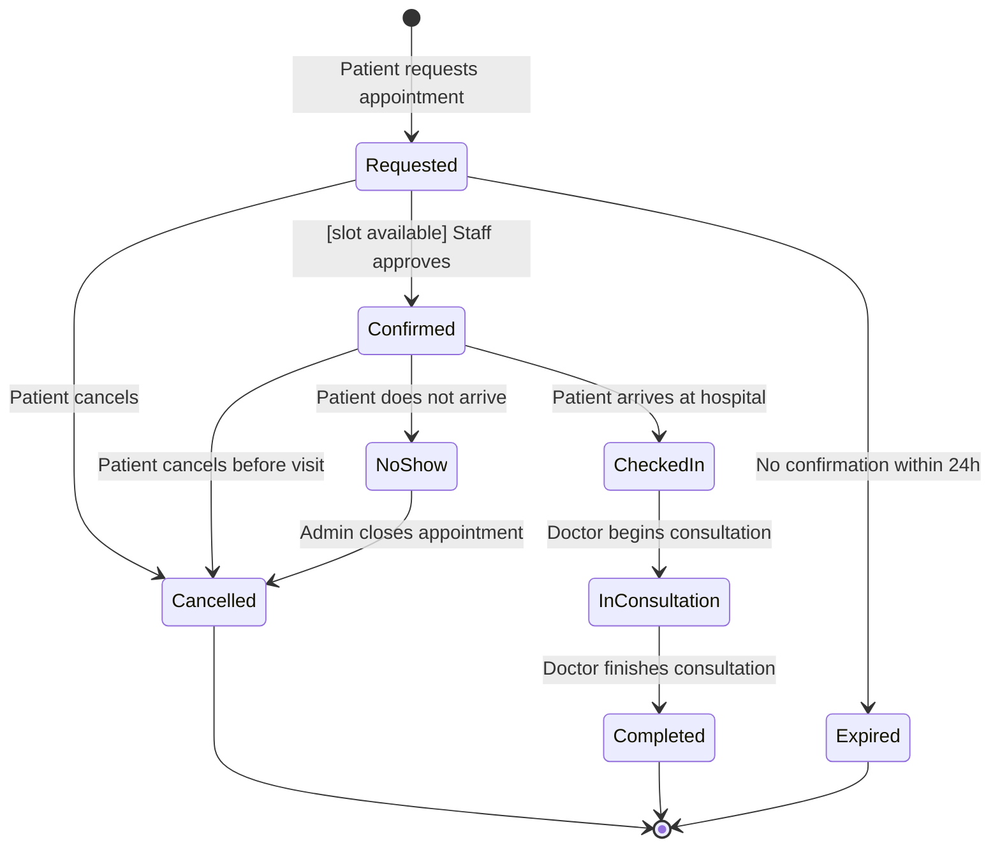
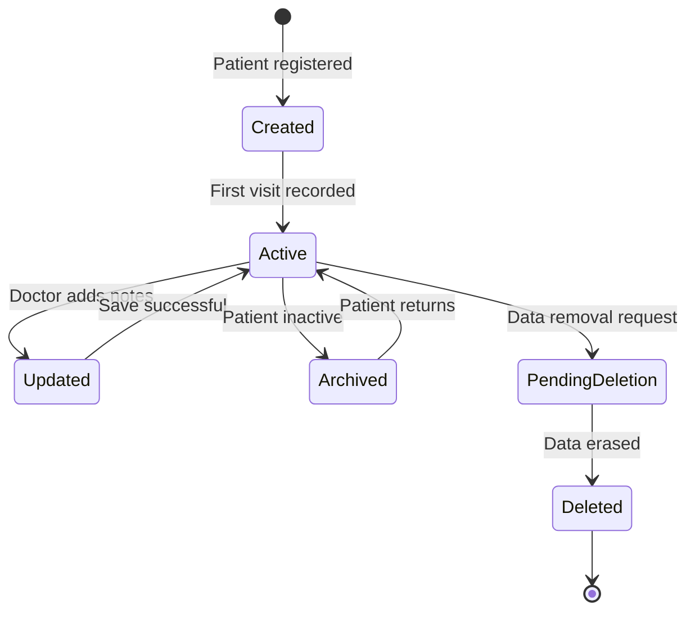
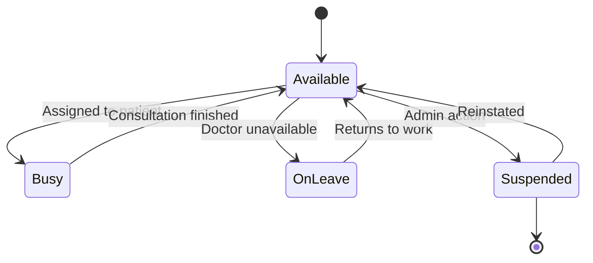
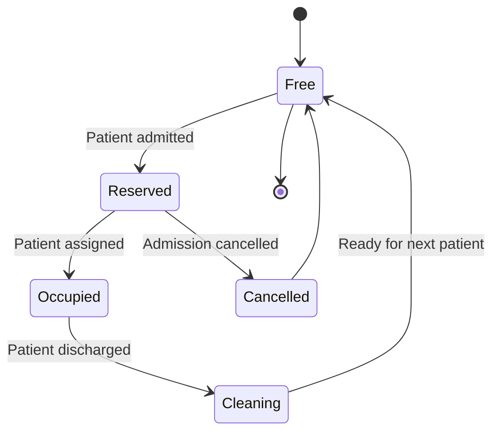
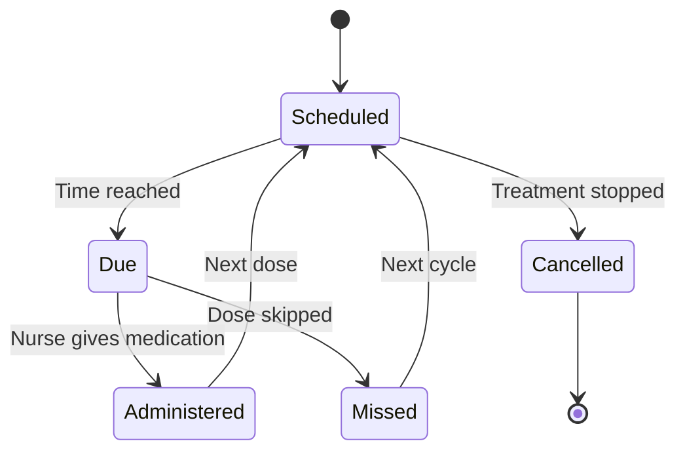
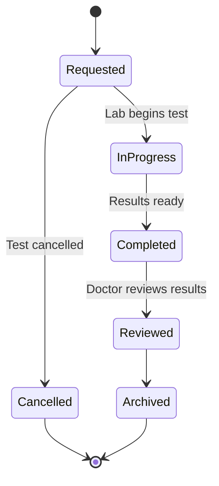
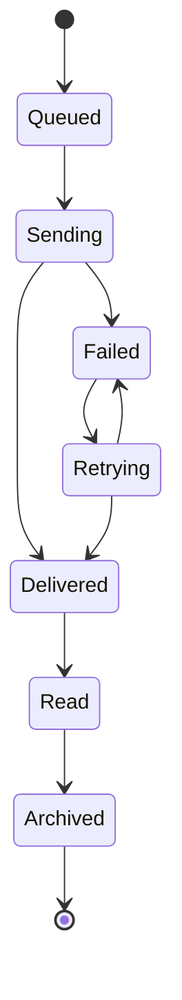

# Rural Hospital Digital System — State Transition Diagrams

## Overview

This document models the lifecycle of 7 critical objects in the Rural Hospital Digital System using UML state transition diagrams (Mermaid). Each diagram defines:

- Object states
- Transitions triggered by system/user events
- Guard conditions ensuring valid state changes

These diagrams align directly with functional requirements (Assignment 4) and user stories (Assignment 6).

---

## Object 1: Patient Appointment

| State | Description |
|-------|-------------|
| Requested | Appointment submitted but not confirmed |
| Confirmed | Slot approved and scheduled |
| CheckedIn | Patient physically present |
| InConsultation | Doctor actively consulting |
| Completed | Consultation finished |
| NoShow | Patient failed to attend |
| Cancelled | Appointment terminated |
| Expired | Request timed out |

**Traceability:** FR-03, FR-04, FR-11 · US-004, US-005

---

## Object 2: Patient Record

Tracks the full lifecycle of digital medical records, from initial creation through archiving or deletion.

**Traceability:** FR-10 (Digital records) · NFR-SEC (Data privacy compliance)

---

## Object 3: Doctor Availability

Controls booking visibility and scheduling accuracy. A doctor must be in the `Available` state before any appointment can be assigned.

---

## Object 4: Bed Allocation

Tracks hospital bed usage — critical for rural hospitals with limited capacity. Beds move through a cleaning cycle before being made available again.

**Traceability:** FR-08 (Patient admission) · FR-09 (Bed management)

---

## Object 5: Medication Schedule

Ensures proper medication adherence by tracking each dose through its full cycle. Missed doses return to the schedule rather than being silently dropped.

---

## Object 6: Lab Test

Tracks diagnostic workflows from request through doctor review and archiving.

---

## Object 7: Notification

Handles reminders and alerts reliably, with automatic retry logic for failed deliveries.

---

## Summary Table

| # | Object | Terminal States | Key Guard Condition |
|---|--------|----------------|---------------------|
| 1 | Patient Appointment | Completed, Cancelled, Expired | Slot must be available before confirmation |
| 2 | Patient Record | Deleted | Data removal request must be submitted first |
| 3 | Doctor Availability | Suspended | Admin action required to suspend or reinstate |
| 4 | Bed Allocation | — (cyclic) | Bed must pass cleaning before returning to Free |
| 5 | Medication Schedule | Cancelled | Treatment stop order required to cancel |
| 6 | Lab Test | Archived, Cancelled | Doctor review required before archiving |
| 7 | Notification | Archived | Delivery retried automatically on failure |
