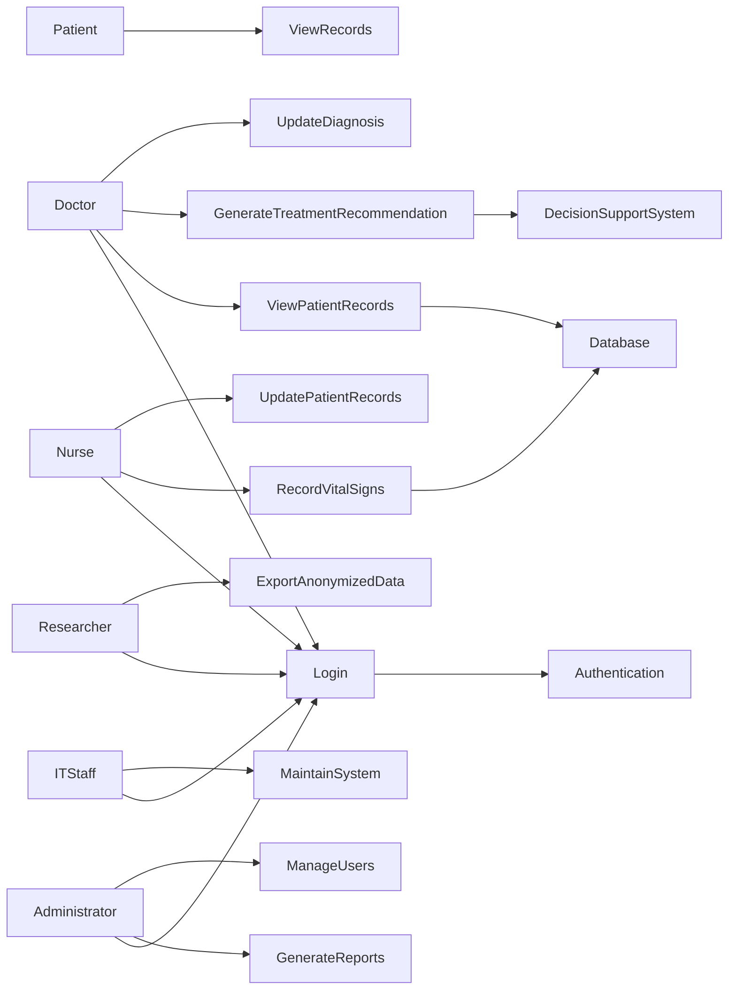

# Use Case Diagram
## Rural Hospital Digital Decision Support System

## Explanation (required for marks)

The main actors in the system are Doctors, Nurses, Administrators, IT Staff, Patients, and Researchers. 
Each actor interacts with the system based on their role in the hospital.

Doctors use the system to view patient records, update diagnoses, and generate treatment recommendations. 
Nurses record patient vital signs and update patient records. Administrators generate reports and manage 
system users. IT staff maintain the system, while researchers export anonymized data for research purposes.

The Login use case is shared by most actors, which shows reuse of functionality. The Generate Treatment 
Recommendation use case supports doctors by helping them make clinical decisions, which addresses the 
stakeholder concern of improving decision-making in rural hospitals.
